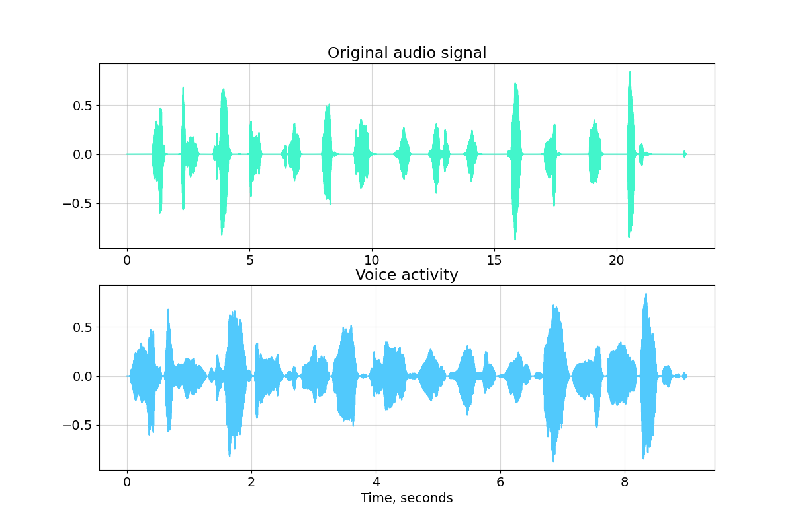

# Voice Activity Detector

This package provides a voice splitting operation for an audio signal containing speech.

## Table of Contents  
[How it works](#HIW)  

<a name="HIW"/>

## How it works
The main goal of this module is to separate speech and noise (silence). It uses special characteristics calles **speech descriptors**. There are a lot of speech descriptors, but this application uses 4 best (in my practice) parameters.

* Short-term energy;
* Zero crossing rate;
* Spectral flatness;
* Spectral rolloff.

All of them easily can detect and separate speech regions. To get the best results, the signal must be divided into overlapping frames before processing. The typical frame duration is 10-100 ms (the default in this application is 30 ms) and the overlap is 50 %. In addition, if we want to improve accuracy, we must use audio signal noise reduction.
Let's deep dive in math.

### Short-term energy
This is the classical signal energy, which is calculated for each frame.

s(m) - power of m's frame, N - number of frames.
