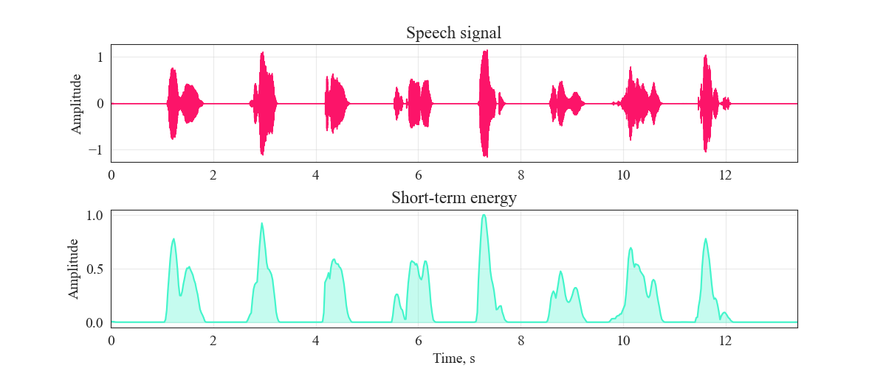
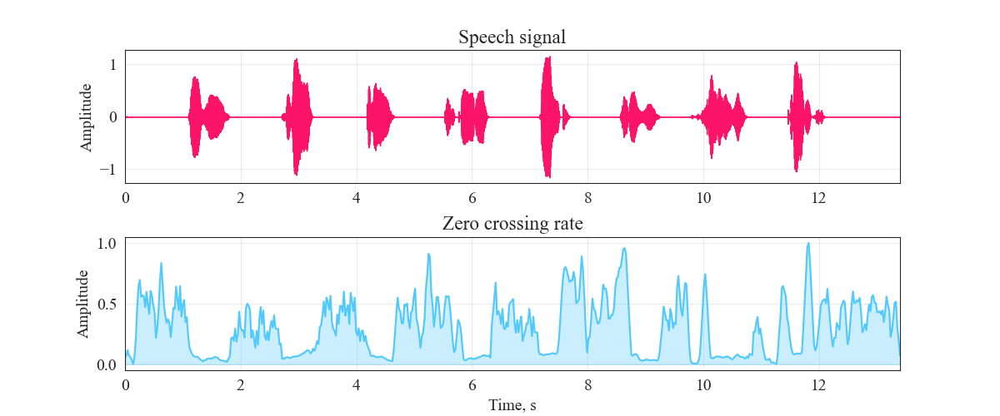
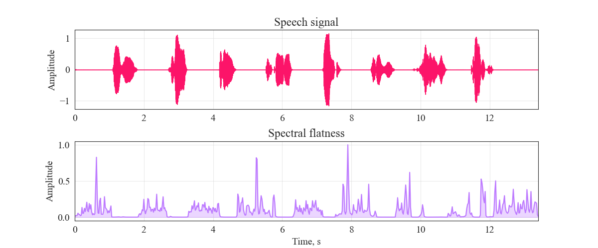
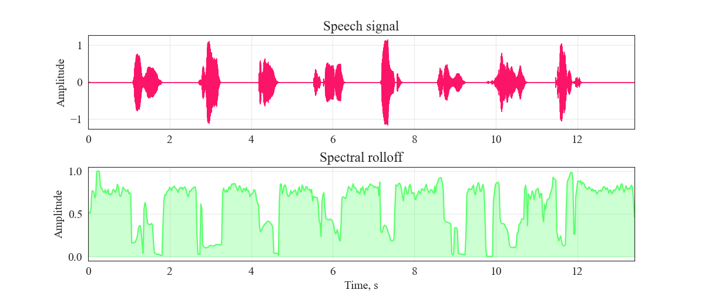
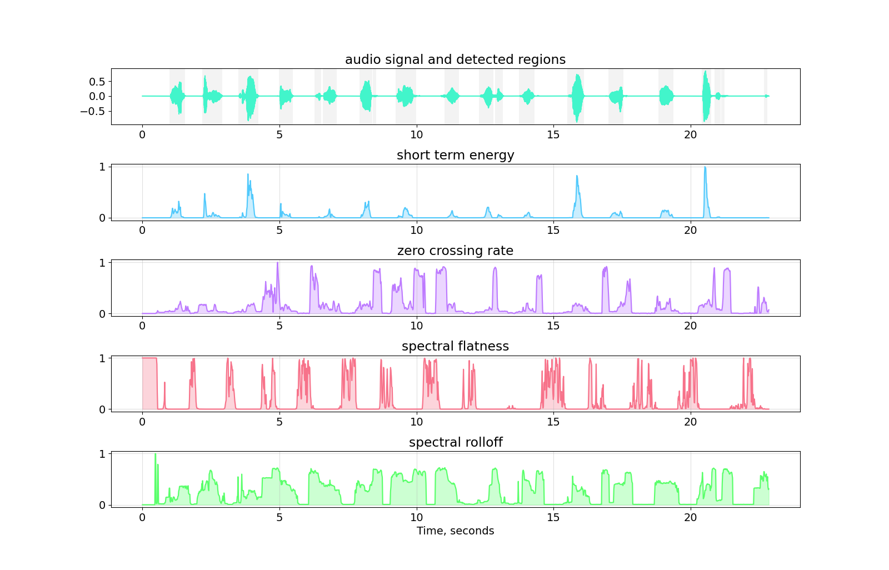

# Voice Activity Detector

This package provides a voice splitting operation for an audio signal containing speech.


## Table of Contents
[Features](#FEAT)

[How it works](#HIW)

[Docs](#DOCS)

[Examples](#Ex)

<a name="FEAT"/>

## Features
* Automated noice reduction [thanks for Tim Sainburg](https://pypi.org/project/noisereduce/);
* Possibility to edit the results of automatic work;
* Detailed visual support;
* Few audio and code examples.


<a name="HIW"/>

## How it works
The main goal of this module is to separate speech and noise (silence). It uses special characteristics calles **speech descriptors**. There are a lot of speech descriptors, but this application uses 4 best (in my practice) parameters.

* Short-term energy;
* Zero crossing rate;
* Spectral flatness;
* Spectral rolloff.

All of them easily can detect and separate speech regions. To get the best results, the signal must be divided into overlapping frames before processing. The typical frame duration is 10-100 ms (the default in this application is 30 ms) and the overlap is 50 %. In addition, if we want to improve accuracy, we must use audio signal noise reduction.
Let's deep dive in math.

### Short-term energy
This is the classical signal energy, which is calculated for each frame.


s(m) - power of m's frame, N - number of frames.



### Zero crossing rate
This value shows how often the signal changes its sign, or how often function of signal cross zero-line. Noise, in comparison with speech, has a higher frequency. Look at the fig.




### Spectral flatness
This is the spectral value. Noise, in comparison with speech, has "flat" spectrum, because all the power is distributed evenly over the entire spectrum.




### Spectral rolloff
Spectral rolloff is the frequency below which a specified percentage of the total spectral energy, e.g. 95%, lies.



### Algorithm
After apply noice reduction (automaticaly in this project) and split audio signal into frames we need to calculate 4 speech descriptors. Frame is considered a speech frame if all the conditions (all the speech descriptions) are True, otherwise, the frame is eliminated. 
If the automatical procedure gives poor results, we may try to change the thresholds of each descriptor, look at the examples.

As a result, we will get the following figure:



<a name="DOCS"/>

## Docs
### VAD
The main VAD class provides automatically speech detection with default values of thresholds.

### Params:
* file: name of audio file with path;
* save_path: path to save cut audio file (default: current dir);
* frame_length: length of each frame (default = 0.03);
* frame_overlap: duration of frames overlap (default = 0.015);
* energy_threshold: threshold of short term energy (default: 5 * 10 ** -6);
* flatness_threshold: threshold of spectral flatness (default: 0.12);
* zerocrossing_threshold: threshold of zero crossing rate (default: 0.9);
* rolloff_threshold: threshold of spectral rolloff (default: 0.7);
* visualise: if True show descriptor graphs that can help to configure thresholds;
* N_frames: number of first silent frames.

### Utils
Auxiliary functions.

<a name="Ex"/>

## Examples
In "examples" folder there are 2 examples. 
### Quickstart

```python
from voice_detection.vad import VAD

if __name__ == '__main__':
    foo = VAD('../audio/count to ten.wav', save_path=r'../results')
```
Or you can set visualise ("z" i know i know) parameter True and see auxiliary graphs.

```python
from voice_detection.vad import VAD

if __name__ == '__main__':
    foo = VAD('../audio/count to ten.wav', save_path=r'../results', visualise=True)
```

### More complex examples
In following examples we change thresholds values to get better results

```python
from voice_detection.vad import VAD

if __name__ == '__main__':
     bar = VAD('../audio/count colors.wav', visualise=True, save_path='../results',
               rolloff_threshold=0.94,
               zerocrossing_threshold=1.05,
               flatness_threshold=2.2)
```

```python
from voice_detection.vad import VAD

if __name__ == '__main__':
    baz = VAD('../audio/boosted count to ten.wav', visualise=True, save_path='../results',
              energy_threshold=-3*10**-1,
              flatness_threshold=0.03)
```
